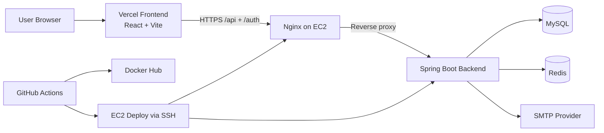

📦 **Inventory Management System**

A full-stack inventory management application built with Spring Boot, MySQL, and React.js. It allows businesses to manage suppliers, products, and stock levels efficiently with features like CRUD operations, real-time updates, and a sell function to track transactions.

---

🚀 **Features**

🔹 **Secure Authentication** - Email registration/login with BCrypt password hashing and JWT sessions.

🔹 **OTP Verification** - 6-digit email OTP verification before first login.

🔹 **Protected APIs** - Product, supplier, sales, and order APIs require Bearer token authentication.

🔹 **Supplier Management** – Add, update, delete, and view suppliers.

🔹 **Product Management** – Manage products with supplier linkage.

🔹 **Sell Functionality** – Reduce stock automatically when a sale is made.

🔹 **Validation & Error Handling** – Prevent deletion of suppliers with linked products.

🔹 **Frontend-Backend Integration** – REST APIs consumed via React frontend.

🔹 **Database Persistence** – MySQL used for relational data storage.

---

🛠️ **Tech Stack**

**Backend:** Java, Spring Boot, Spring Data JPA, Spring Security, JWT, Java Mail, Flyway  
**Frontend:** React.js, TypeScript, Tailwind CSS, Framer Motion  
**Database:** MySQL  
**Build Tools:** Maven, npm  
**Other:** Git, Postman (for testing APIs)

---

⚙️ **Installation & Setup**

1️⃣ **Clone the Repository**
```powershell
git clone https://github.com/Anjan-Kumar-Sahoo/GoDamm.git
cd GoDamm
```

# Godamm Inventory Management System

Production-ready full-stack inventory platform with secure auth, OTP workflows, tenant-safe data isolation, Redis caching, and EC2/Vercel deployment support.

## Live Domains

- Frontend: https://godamm.mraks.dev
- Frontend (secondary): https://godamm.anjaliv.dev
- Backend API: https://api.godamm.mraks.dev

## Architecture



## Stack

- Backend: Java 17, Spring Boot 3, Spring Security, JWT, Flyway, Redis Cache, Actuator
- Frontend: React 18, TypeScript, Vite, Tailwind CSS, Framer Motion
- Data: MySQL 8, Redis 7
- DevOps: Docker, Docker Compose, GitHub Actions, Nginx, Certbot, AWS EC2

## Repository Structure

```text
backend/                    Spring Boot application
frontend/                   React + Vite application
deploy/ec2-single-node/     EC2 scripts, Nginx config, service units
.github/workflows/          CI/CD workflows
docker-compose.yml          Backend + MySQL + Redis stack
.env.example                Environment template
```

## Environment Variables

Copy `.env.example` to `.env` and fill real values.

### Required backend variables

- DB_URL
- DB_USERNAME
- DB_PASSWORD
- JWT_SECRET
- REDIS_HOST
- REDIS_PORT
- REDIS_PASSWORD
- MAIL_HOST
- MAIL_PORT
- MAIL_USERNAME
- MAIL_PASSWORD
- CORS_ALLOWED_ORIGINS

Mail notes:
- Spring Boot uses Java Mail over SMTP, so `MAIL_HOST` and `MAIL_PORT` are both required.
- Common provider ports are `587` (STARTTLS) and `465` (SSL/TLS).

### Required frontend variable (Vercel)

- VITE_API_BASE_URL=https://api.godamm.mraks.dev
- VITE_API_URL=https://api.godamm.mraks.dev (supported alias)

## Local Development

### Option A: Full stack with Docker (recommended)

```bash
cp .env.example .env
docker compose up -d --build
```

Backend health:

```bash
curl -fsS http://localhost:8080/actuator/health
```

### Option B: Backend and frontend separately

Backend:

```bash
cd backend
mvn spring-boot:run
```

Frontend:

```bash
cd frontend
npm install
npm run dev
```

## Dockerization

- Backend Dockerfile uses multi-stage build
	- Build stage: Maven + JDK 17
	- Runtime stage: openjdk:17-jdk-slim
- Health check endpoint: /actuator/health
- Compose stack includes:
	- backend
	- mysql (persistent volume, optional when using external RDS)
	- redis (password-protected)

## CI/CD (GitHub Actions)

Workflow: `.github/workflows/backend.yml`

Pipeline steps:

1. Checkout
2. Setup Java 17
3. Build + test (`mvn clean verify`)
4. Build Docker image
5. Push image to Docker Hub
6. SSH into EC2
7. Pull commit-SHA image and restart backend container

### Required GitHub Secrets

- DOCKER_PASSWORD
- EC2_HOST
- EC2_USER
- EC2_SSH_KEY

## AWS EC2 Deployment

Detailed runbook: `deploy/ec2-single-node/README.md`

Quick path:

```bash
sudo bash deploy/ec2-single-node/setup-ec2-4gb.sh
cd ~/GoDamm
cp deploy/ec2-single-node/backend.env.example .env
nano .env
bash deploy/ec2-single-node/deploy-app.sh
```

Nginx config file:

- `deploy/ec2-single-node/nginx-inventory.conf`

Enable HTTPS:

```bash
sudo certbot --nginx -d api.godamm.mraks.dev
```

### Using AWS RDS MySQL (optional)

Set these values in EC2 `.env`:

- DB_URL=jdbc:mysql://<rds-endpoint>:3306/godamm?useSSL=true&requireSSL=true&serverTimezone=UTC
- DB_USERNAME=<rds-username>
- DB_PASSWORD=<rds-password>

Notes:

- Allow port 3306 in RDS security group from the EC2 security group.
- Keep `BACKEND_IMAGE` pinned to a commit SHA tag.
- `deploy/ec2-single-node/deploy-app.sh` will skip local mysql container automatically when DB_URL is external.

## Security Hardening

- Stateless JWT security
- Strict env-driven CORS origin policy
- Redis-backed rate limiting
- Optional HTTPS enforcement via `REQUIRE_HTTPS=true`
- Input validation on DTOs and auth payloads
- Non-root app credentials for MySQL
- No hardcoded secrets in source

## Monitoring and Logging

Actuator endpoints:

- `/actuator/health`
- `/actuator/metrics`

Logging:

- Console logs
- File logs (`logs/inventory-app.log`)
- Structured JSON-like log pattern

## Performance Notes

- Redis cache for product/supplier/profit reads
- Cache eviction on writes
- HikariCP pool tuning via env vars
- 4 GB deployment profile tuned for small production usage

## Testing

Run backend tests:

```bash
cd backend
mvn clean verify
```

CI fails on test/build failures by default.

## One-command Deploy on EC2

After bootstrap and `.env` setup:

```bash
bash deploy/ec2-single-node/deploy-app.sh
```

This pulls the commit-SHA backend image and applies container updates using Docker Compose.
